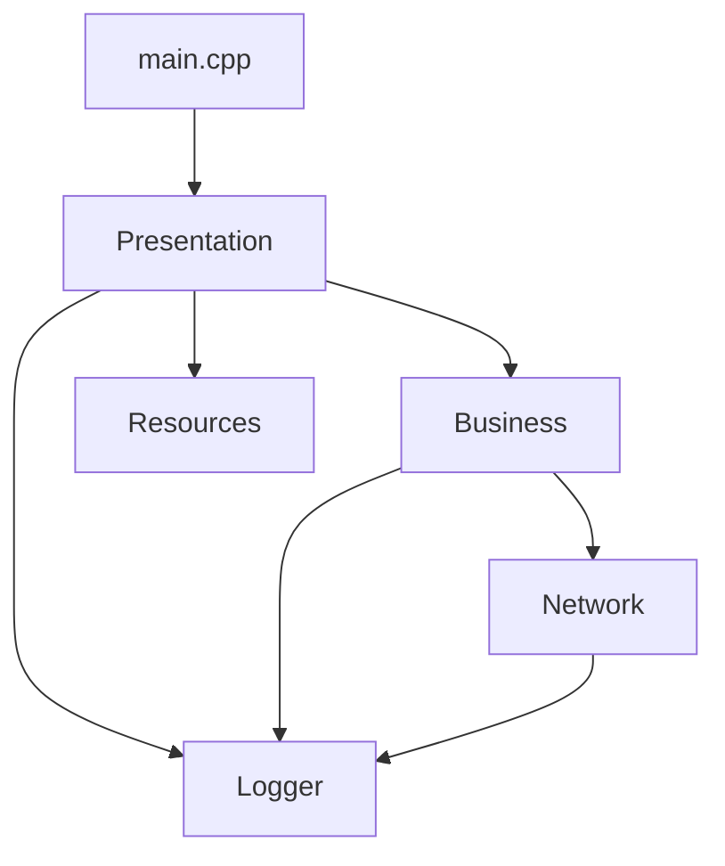

## 客户端重构架构

### 1. **整体架构分层**

```
Client/
├── main.cpp              # 应用入口（唯一）
├── Presentation/         # 表现层 (UI)
├── Business/            # 业务逻辑层
├── Network/            # 网络通信层
├── Logger/             # 日志模块
└── Resources/          # 资源文件
```

### 2. **详细分层结构**

#### **main.cpp (应用入口)**
```cpp
// 主要职责：
// - 应用程序初始化
// - 日志系统初始化
// - 网络客户端初始化
// - 登录流程控制
// - 主窗口显示
```

#### **Presentation 层 (表现层)**
```
Presentation/
├── dialogs/                   # 对话框
│   ├── LoginDialog/
│   │   ├── login_dialog.cpp
│   │   ├── login_dialog.h
│   │   └── login_dialog.ui
│   ├── RegisterDialog/
│   │   ├── register_dialog.cpp
│   │   ├── register_dialog.h
│   │   └── register_dialog.ui
│   ├── TicketDialog/
│   |   ├── ticket_dialog.cpp
│   |   ├── ticket_dialog.h
│   |   └── ticket_dialog.ui
│   ├── TicketDialogDetail/
│   |   ├── ticket_dialog_detail.cpp
│   |   ├── ticket_dialog_detail.h
│   |   └── ticket_dialog_detail.ui
│   └── AddTicket/
│       ├── add_ticket.cpp
│       ├── add_ticket.h
│       └── add_ticket.ui
├── pages/                     # 页面
│   ├── HomePage/
│   │   ├── home_page.cpp
│   │   ├── home_page.h
│   │   └── home_page.ui
│   ├── TicketPage/
│   │   ├── ticket_page.cpp
│   │   ├── ticket_page.h
│   │   └── ticket_page.ui
│   ├── ThanksPage/
│   │   ├── thanks_page.cpp
│   │   ├── thanks_page.h
│   │   └── thanks_page.ui
│   └── SettingPage/
│       ├── setting_page.cpp
│       ├── setting_page.h
│       └── setting_page.ui
├── main_window/              # 主窗口
│   ├── home_main_window.cpp
│   ├── home_main_window.h
│   └── home_main_window.ui
└── utils/                    # UI工具类
    ├── ticket_schema.cpp
    ├── ticket_schema.h
    ├── theme.cpp
    └── theme.h
    
```

#### **Business 层 (业务逻辑层)**
```
Business/
├── services/                  # 业务服务
│   ├── AuthService.cpp        # 认证服务
│   ├── AuthService.h
│   ├── TicketService.cpp      # 工单服务
│   ├── TicketService.h
│   ├── UserService.cpp        # 用户服务
│   └── UserService.h
├── models/                    # 业务模型
│   ├── User.cpp
│   ├── User.h
│   ├── Ticket.cpp
│   ├── Ticket.h
│   ├── Message.cpp
│   └── Message.h
└── managers/                  # 业务管理器
    ├── SessionManager.cpp     # 会话管理
    └── SessionManager.h
```

#### **Network 层 (网络通信层)**
```
Network/
├── client/                   # 网络客户端
│   ├── NetworkClient.cpp
│   ├── NetworkClient.h
│   ├── TcpClient.cpp
│   └── TcpClient.h
├── connection/               # 连接管理
│   ├── ConnectionManager.cpp
│   └── ConnectionManager.h
└── protocol/                 # 协议处理
    ├── ProtocolHandler.cpp
    ├── ProtocolHandler.h
    ├── MessageRouter.cpp
    ├── MessageRouter.h
    └── handlers/            # 协议处理器
        ├── AuthHandler.cpp
        ├── AuthHandler.h
        ├── TicketHandler.cpp
        ├── TicketHandler.h
        ├── UserHandler.cpp
        └── UserHandler.h
```

#### **Logger 层 (日志模块)**

参考服务端实现。

#### **Resources 层 (资源文件)**
```
Resources/
├── images/                   # 图片资源
│   ├── icons/
│   ├── backgrounds/
│   └── logos/
├── styles/                   # 样式文件
│   ├── themes/
│   │   ├── dark_theme.qss
│   │   └── light_theme.qss
│   └── components/
├── fonts/                    # 字体文件
└── resources.qrc            # Qt资源文件
```

### 3. **依赖关系图**

```
main.cpp
    ↓
Presentation → Business → Network
    ↓              ↓         ↓
   Logger ←────── Logger ←── Logger

Resources (UI资源，主要被Presentation层使用)
```

或mermaid

